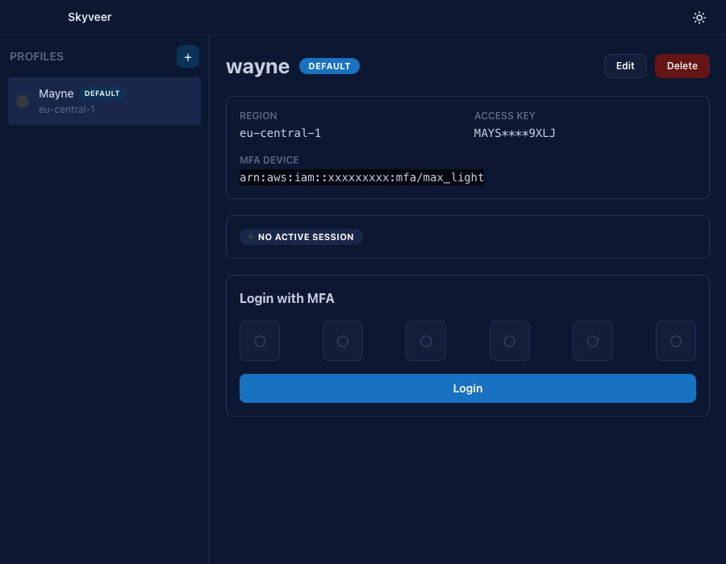
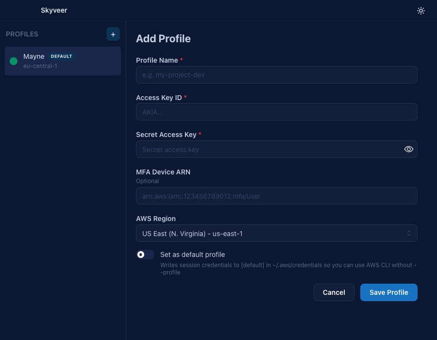
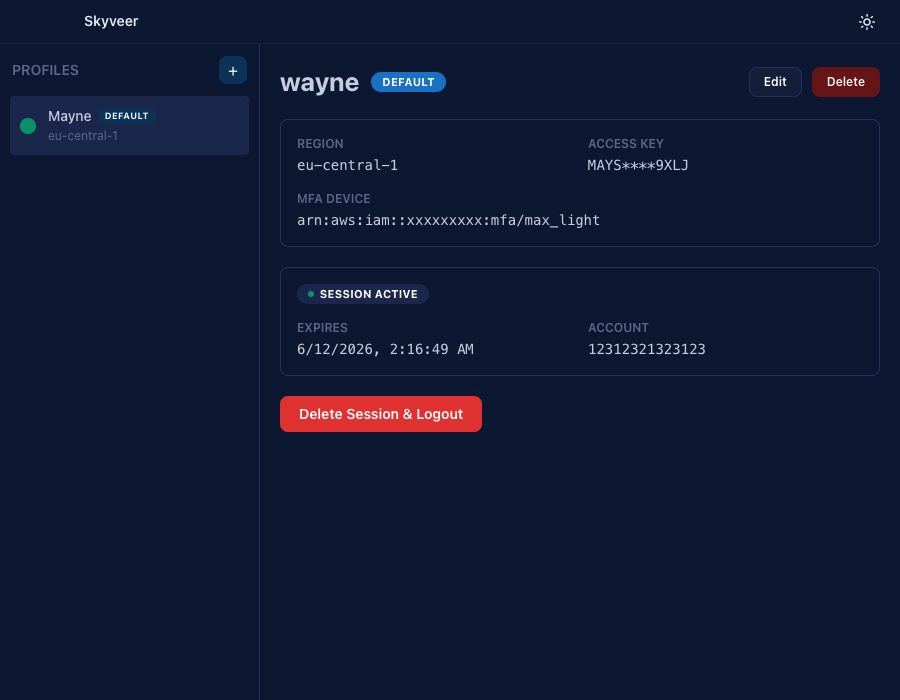

<br clear="left" /> 

# Skyveer

> A sleek desktop app to manage AWS profiles, MFA logins, and session credentials — all locally on your machine.

Built with **Electron**, **React**, and the **AWS SDK**.

---

## 📸 Screenshots

| Profile list | Add profile | Login with MFA |
| :---: | :---: | :---: |
| <a href="public/capture-1.png"></a> | <a href="public/capture-2.png"></a> | <a href="public/capture-3.png"></a> |

---

## 📥 Download

Grab the latest installer for your platform from the [**Releases**](https://github.com/juandl/skyveer/releases/latest) page:

- 🍎 **macOS** — `.dmg`
- 🪟 **Windows** — `.exe` installer
- 🐧 **Linux** — `.AppImage`

---

## ✨ Features

- **Profile Management** — Add, edit, and delete AWS profiles (access key, secret key, MFA device ARN, region)
- **MFA / OTP Login** — Authenticate with a 6-digit OTP code to get temporary session credentials via `sts:GetSessionToken`
- **Default Profile** — Mark any profile as the default to automatically write credentials to the `[default]` section in `~/.aws/credentials`
- **Session Tracking** — View session status (active, expired, or none) with automatic verification via `sts:GetCallerIdentity`
- **Credential Sync** — On login, writes session credentials to `~/.aws/credentials` and region config to `~/.aws/config`
- **Session Cleanup** — Delete sessions and remove credentials from AWS config files
- **12-Hour Sessions** — Requests STS tokens with a 12-hour duration

---

## 🛣️ Upcoming Features

- **More cloud providers** — bring profile + session management beyond AWS (GCP, Azure, etc.)
- **Workspaces** — group profiles by project / team / environment
- **Console per provider** — open a scoped terminal for each profile without ever writing credentials to disk

---

## 🚀 How It Works

1. **Add a Profile** — Enter your IAM access key, secret key, optional MFA device ARN, AWS region, and a profile name
2. **Login** — Enter your OTP code (if MFA is configured) and click Login. The app calls `sts:GetSessionToken` and writes the temporary credentials to `~/.aws/credentials`
3. **Use AWS CLI** — After login, use the AWS CLI with `--profile <name>` or without any flag if the profile is set as default
4. **Logout** — Click "Delete Session & Logout" to remove the session and clear credentials from `~/.aws/credentials`

### Default Profile Behavior

When a profile is marked as default:
- Login writes credentials to both `[profile-name]` and `[default]` sections
- Logout clears both sections
- Only one profile can be default at a time
- You can switch the default at any time from the profile detail view

### Files Modified

| File | Description |
|------|-------------|
| `~/.aws/credentials` | Session credentials (`aws_access_key_id`, `aws_secret_access_key`, `aws_session_token`) |
| `~/.aws/config` | Region and output format per profile |

> Profile data (keys, MFA device, settings) is stored in Electron's app data directory, **not** in `~/.aws/`.

---

## 🧰 Tech Stack

| Technology | Purpose |
|------------|---------|
| [Electron](https://www.electronjs.org/) | Desktop app framework |
| [React](https://react.dev/) | UI components |
| [Vite](https://vite.dev/) | Build tool and dev server |
| [@aws-sdk/client-sts](https://docs.aws.amazon.com/AWSJavaScriptSDK/v3/latest/client/sts/) | AWS STS API calls (GetSessionToken, GetCallerIdentity) |
| [electron-builder](https://www.electron.build/) | App packaging and distribution |

---

## 📁 Project Structure

```
skyveer/
├── src/
│   ├── main/                       # Electron main process (TypeScript, CommonJS)
│   │   ├── index.ts                # Entry: app lifecycle + IPC handlers
│   │   ├── preload.ts              # Context bridge exposing typed `window.api`
│   │   ├── config/app.ts           # APP_NAME, window dims, dev URL
│   │   └── constants/aws.ts        # AWS paths, default region, session duration
│   ├── renderer/                   # React app (TypeScript, ESM)
│   │   ├── index.html              # Vite HTML entry
│   │   ├── index.tsx               # React mount
│   │   ├── App.tsx                 # Root component, state management
│   │   ├── styles.css              # Global styles (dark theme)
│   │   ├── config/app.ts           # APP_NAME for the UI
│   │   ├── constants/
│   │   │   ├── regions.ts          # AWS region list + AwsRegion type
│   │   │   └── ui.ts               # Toast/view/session-status enums + types
│   │   └── components/
│   │       ├── Sidebar.tsx
│   │       ├── ProfileForm.tsx
│   │       ├── ProfileDetail.tsx
│   │       ├── EmptyState.tsx
│   │       └── Toast.tsx
│   └── shared/types/               # Types shared between main and renderer
│       ├── profile.ts              # Profile, Session, ProfileInput, LoginResult, …
│       ├── api.ts                  # ElectronAPI + global Window augmentation
│       └── ipc.ts                  # IPC channel constants + payload types
├── build/
│   ├── icon.png                    # App icon source (1024x1024)
│   └── icon.icns                   # macOS icon
├── tsconfig.json                   # Renderer TS config (DOM, ESM)
├── tsconfig.main.json              # Main-process TS config (Node, CJS) → dist-electron/
├── tsconfig.node.json              # vite.config.ts
├── vite.config.ts
├── dist/                           # Renderer build output (Vite bundle)
└── dist-electron/                  # Compiled main process (tsc output)
```

---

## 🧑‍💻 Development

```bash
# Install dependencies
npm install

# Run in development mode (Vite dev server + Electron)
npm start

# Build the React app only
npm run build

# Preview production build locally
npm run preview
```

---

## 📦 Building the App

```bash
# Build and package as installable app
npm run dist
```

**Output:**
- 🍎 **macOS**: `dist/Skyveer-<version>-arm64.dmg`
- 🪟 **Windows**: `dist/Skyveer Setup <version>.exe`
- 🐧 **Linux**: `dist/Skyveer-<version>.AppImage`

---

## ✅ Prerequisites

- [Node.js](https://nodejs.org/) >= 18
- An AWS IAM user with access keys and (optionally) an MFA device configured

---

## 🛡️ Security Notes

- AWS access keys and secret keys are stored locally in Electron's app data directory (`~/Library/Application Support/skyveer/` on macOS)
- Session tokens are temporary (12-hour expiration)
- The app **never** sends credentials to any third-party service — all calls go directly to AWS STS

---

## 📜 License

Mozilla Public License 2.0 (MPL-2.0) — see [LICENSE](LICENSE).
